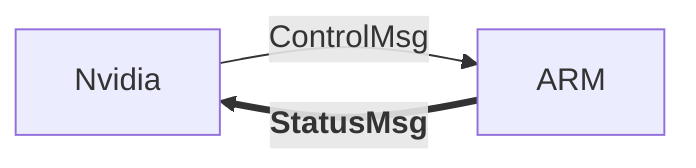

# AGV-development
AGV development
### StatusMsg




#### StatusMsg

```c
typedef struct
{
    LifterStatus status_lifter;
    WheelStatus status_wheel;
    BumperStatus status_bumper;
    BatteryStatus status_battery;
} StatusMsg;
```


#### LifterStatus

```c
typedef struct
{
    bool is_enabled;
    int32_t currentPosition;
    bool is_top;		// when the lifter is upto the top, it is true, otherwise it's false
    bool is_bottom;		// when reached bottom, it is true, otherwise it's false
    
} LifterStatus;
```


#### WheelStatus

```c
typedef struct
{
    bool is_enabled;	// when the servo has been enabled
    bool is_running;	// when the motor is running without error, it will be true
    bool is_error;		// when there are some error in the servo or the motor, it will be true
    bool is_stopped;	// when speed is 0m/s, it will be true
} WheelStatus;
```


#### BumperStatus

```c
typedef struct
{
    bool is_enabled;	// when the bumper sensors are enabled
    bool is_hitted;		// when the agv hitted something, disaster occurs
    uint8_t hitted_bumper_index;	// 0x00: none, 0x01: front, 0x02: back, 0x04: left, 0x08: right
} BumperStatus;
```


#### BatteryStatus

```c
typedef struct
{
    bool is_enabled;
    bool is_running;	// when the battery is on;
    uint8_t error_index;	// errors about the battery;
    uint8_t battery_level;	// value from 0 to 100, unit is %;
} BatteryStatus;
```


The final message transportation will be SPI, high-speed-sync-communication.

Message will be combined with a bunch of 8-bit bytes, with CRC-32 at the end of the message.
